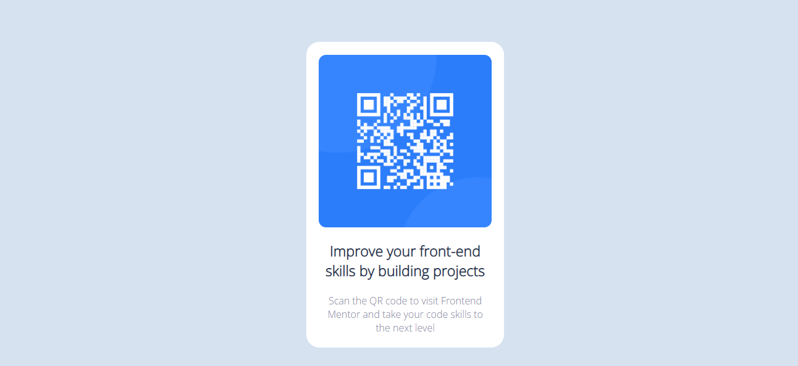

# Frontend Mentor - QR code component solution

This is a solution to the [QR code component challenge on Frontend Mentor](https://www.frontendmentor.io/challenges/qr-code-component-iux_sIO_H). Frontend Mentor challenges help you improve your coding skills by building realistic projects. 

### Screenshot

### Links

- Solution URL: [Add solution URL here](https://your-solution-url.com)

### Built with

- Semantic HTML5 markup
- CSS custom properties
- Flexbox
- CSS Grid

### What I learned

With this project I was able to cement my knowledge about boxes, images, text and their configurations.

### Continued development

For my next projects I intend on continuing with my practice of HTML5, CSS and JS. Since my coding needs polishing.

### Useful resources

- [w3schools](https://www.w3schools.com/css/css_align.asp) - This guide assisted me in remembering key commands to manipulate elements of the page.

## Author

- Frontend Mentor - [@MarcosMeloPyRu](https://www.frontendmentor.io/profile/MarcosMeloPyRu)# qr-code-component-main
